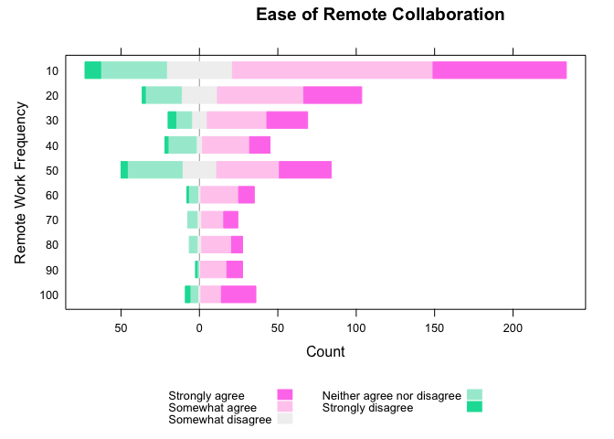
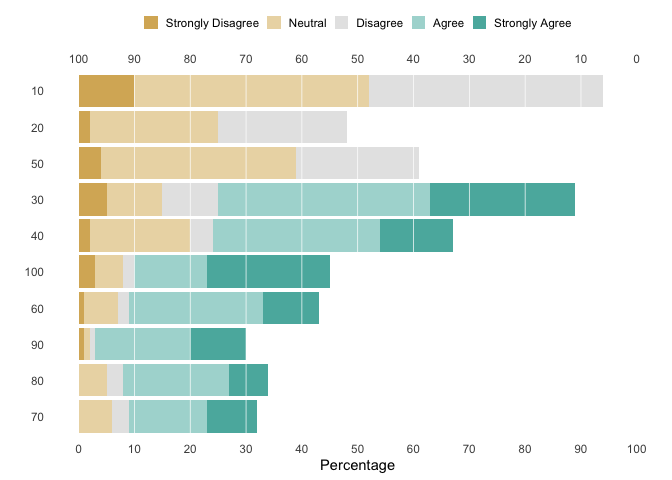
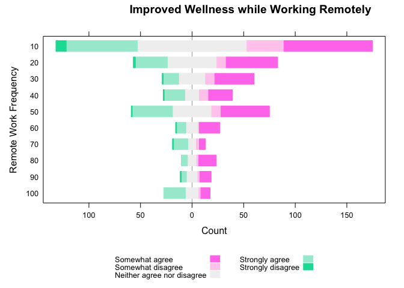
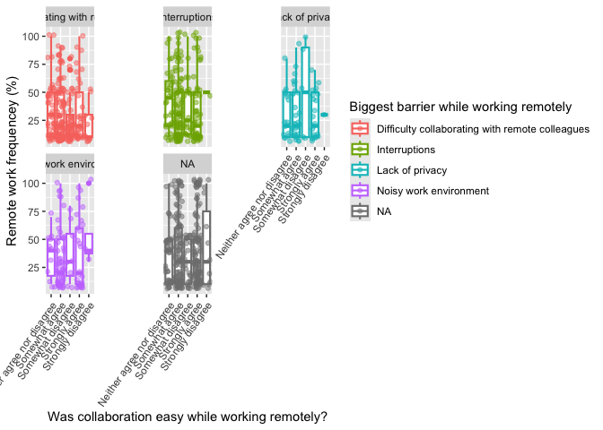
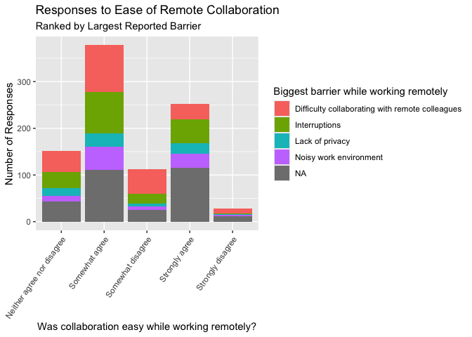
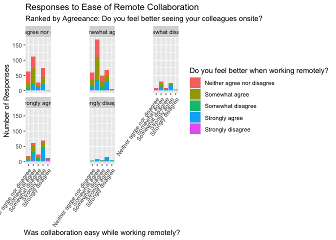
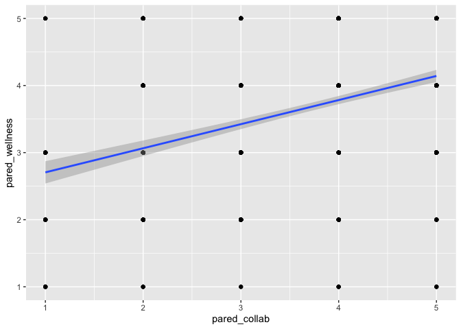
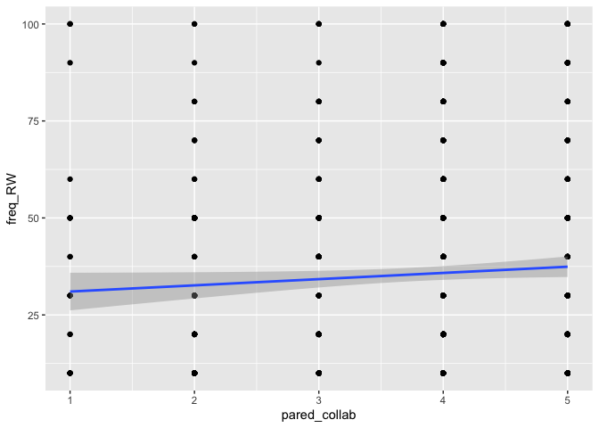
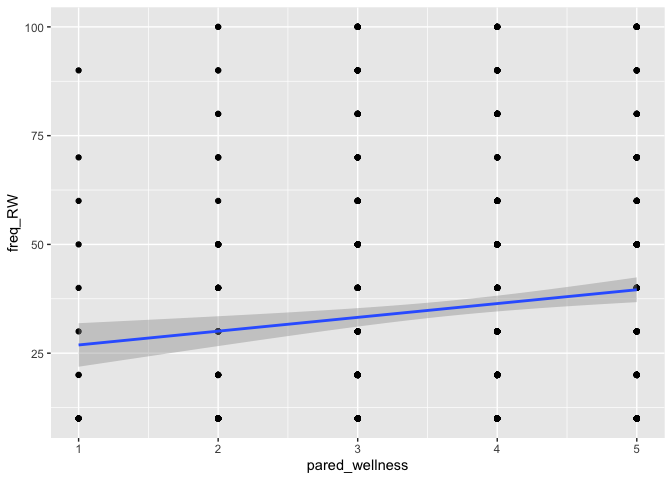

NSW-500
================
Paris Heard
2024-12-11

# Learning Objectives

- Understand the relationship between reported effective collaboration
  and remote work
- Explore the relationship between leadership, team culture, and the
  effectiveness of collaboration
- Gain insight into the desires of the average employee, by industry

## Package Installations

``` r
set.seed(2)

# EDA
library(tidyverse)
```

    ## ── Attaching core tidyverse packages ──────────────────────── tidyverse 2.0.0 ──
    ## ✔ dplyr     1.1.4     ✔ readr     2.1.5
    ## ✔ forcats   1.0.0     ✔ stringr   1.5.1
    ## ✔ ggplot2   3.5.1     ✔ tibble    3.2.1
    ## ✔ lubridate 1.9.3     ✔ tidyr     1.3.1
    ## ✔ purrr     1.0.2     
    ## ── Conflicts ────────────────────────────────────────── tidyverse_conflicts() ──
    ## ✖ dplyr::filter() masks stats::filter()
    ## ✖ dplyr::lag()    masks stats::lag()
    ## ℹ Use the conflicted package (<http://conflicted.r-lib.org/>) to force all conflicts to become errors

``` r
library(ggplot2)
library(dplyr)
library(reshape2)
```

    ## 
    ## Attaching package: 'reshape2'
    ## 
    ## The following object is masked from 'package:tidyr':
    ## 
    ##     smiths

``` r
# Regression
library(infer)
library(MASS)
```

    ## 
    ## Attaching package: 'MASS'
    ## 
    ## The following object is masked from 'package:dplyr':
    ## 
    ##     select

``` r
library(foreign)
library(moderndive)
library(Hmisc)
```

    ## 
    ## Attaching package: 'Hmisc'
    ## 
    ## The following objects are masked from 'package:dplyr':
    ## 
    ##     src, summarize
    ## 
    ## The following objects are masked from 'package:base':
    ## 
    ##     format.pval, units

``` r
library(reshape2)
library(mosaicCore)
```

    ## 
    ## Attaching package: 'mosaicCore'
    ## 
    ## The following objects are masked from 'package:dplyr':
    ## 
    ##     count, tally

``` r
library(car)
```

    ## Loading required package: carData
    ## 
    ## Attaching package: 'car'
    ## 
    ## The following object is masked from 'package:mosaicCore':
    ## 
    ##     logit
    ## 
    ## The following object is masked from 'package:dplyr':
    ## 
    ##     recode
    ## 
    ## The following object is masked from 'package:purrr':
    ## 
    ##     some

``` r
# Plotting
library(HH)
```

    ## Loading required package: lattice
    ## Loading required package: grid
    ## Loading required package: latticeExtra
    ## 
    ## Attaching package: 'latticeExtra'
    ## 
    ## The following object is masked from 'package:ggplot2':
    ## 
    ##     layer
    ## 
    ## Loading required package: multcomp
    ## Loading required package: mvtnorm
    ## Loading required package: survival
    ## Loading required package: TH.data
    ## 
    ## Attaching package: 'TH.data'
    ## 
    ## The following object is masked from 'package:MASS':
    ## 
    ##     geyser
    ## 
    ## Loading required package: gridExtra
    ## 
    ## Attaching package: 'gridExtra'
    ## 
    ## The following object is masked from 'package:dplyr':
    ## 
    ##     combine
    ## 
    ## 
    ## Attaching package: 'HH'
    ## 
    ## The following objects are masked from 'package:car':
    ## 
    ##     logit, vif
    ## 
    ## The following object is masked from 'package:mosaicCore':
    ## 
    ##     logit
    ## 
    ## The following object is masked from 'package:lubridate':
    ## 
    ##     interval
    ## 
    ## The following object is masked from 'package:purrr':
    ## 
    ##     transpose
    ## 
    ## The following object is masked from 'package:base':
    ## 
    ##     is.R

``` r
library(likert)
```

    ## Loading required package: xtable
    ## 
    ## Attaching package: 'xtable'
    ## 
    ## The following objects are masked from 'package:Hmisc':
    ## 
    ##     label, label<-
    ## 
    ## Registered S3 method overwritten by 'likert':
    ##   method      from
    ##   plot.likert HH  
    ## 
    ## Attaching package: 'likert'
    ## 
    ## The following object is masked from 'package:HH':
    ## 
    ##     likert
    ## 
    ## The following object is masked from 'package:car':
    ## 
    ##     recode
    ## 
    ## The following object is masked from 'package:dplyr':
    ## 
    ##     recode

``` r
library(colorspace)
library(RColorBrewer)
library(grid)

# Output/Resources
library(knitr)
library(readr)
library("data.table")
```

    ## 
    ## Attaching package: 'data.table'
    ## 
    ## The following object is masked from 'package:HH':
    ## 
    ##     transpose
    ## 
    ## The following objects are masked from 'package:reshape2':
    ## 
    ##     dcast, melt
    ## 
    ## The following objects are masked from 'package:lubridate':
    ## 
    ##     hour, isoweek, mday, minute, month, quarter, second, wday, week,
    ##     yday, year
    ## 
    ## The following objects are masked from 'package:dplyr':
    ## 
    ##     between, first, last
    ## 
    ## The following object is masked from 'package:purrr':
    ## 
    ##     transpose

## Creating Data-frame

``` r
sdata <- read.csv("data/data.csv", header = TRUE, sep = ",")
```

## Cleaning Data

``` r
head(sdata)
```

    ##     ID birth_year gender         yr_experience
    ## 1  451       1982   Male Between 1 and 5 years
    ## 2  462       1993 Female Between 1 and 5 years
    ## 3  765       1994 Female Between 1 and 5 years
    ## 4 1358       1977   Male     More than 5 years
    ## 5 1293       1962   Male     More than 5 years
    ## 6  993       1993   Male Between 1 and 5 years
    ##                                   industry
    ## 1                   Accommodation and Food
    ## 2                   Education and Training
    ## 3                           Other Services
    ## 4 Information Media and Telecommunications
    ## 5        Agriculture, Forestry and Fishing
    ## 6 Information Media and Telecommunications
    ##                                                                  occupation
    ## 1                       Managers - Hospitality, Retail and Service Managers
    ## 2                                   Professionals - Education Professionals
    ## 3                                   Professionals - Education Professionals
    ## 4                                         Professionals - ICT Professionals
    ## 5     Technicians and trades workers - Other Technicians and Trades Workers
    ## 6 Technicians and trades workers - Engineering, ICT and Science Technicians
    ##                       num_employees                    household_size
    ## 1                  Between 5 and 19    Couple with dependent children
    ## 2                     More than 200                     Single person
    ## 3                     More than 200                     Single person
    ## 4                  Between 5 and 19 Couple with no dependent children
    ## 5 I am a sole trader/owner-operator                     Single person
    ## 6                  Between 5 and 19         Multiple family household
    ##   metro_regional perc_RW_last_q pref_perc_RW_last_q perc_RW_last_yr
    ## 1       Regional            10%                 10%             10%
    ## 2          Metro             0%                  0%              0%
    ## 3          Metro            10%                 20%             20%
    ## 4          Metro             0%                  0%             10%
    ## 5       Regional            70%                 70%             10%
    ## 6          Metro           100%                100%             50%
    ##   pref_perc_RW_last_yr pref_RW_post_covid update_RW_agreement_post_covid
    ## 1                  10%                10%                             No
    ## 2                   0%                 0%                             No
    ## 3                  20%                20%                            Yes
    ## 4                   0%                 0%                            Yes
    ## 5                   0%                 0%                            Yes
    ## 6                  50%                50%                             No
    ##   worked_RW_past_six_months frequency_RW pref_frequency_RW
    ## 1                       Yes          10%               10%
    ## 2                        No                               
    ## 3                       Yes          20%               20%
    ## 4                        No                               
    ## 5                        No                               
    ## 6                        No                               
    ##   employer_onsite_policy perc_required_onsite  employers_policy_suits_me
    ## 1                    Yes                 100%             Strongly agree
    ## 2                    Yes                 100% Neither agree nor disagree
    ## 3                 Unsure                                  Somewhat agree
    ## 4                     No                                  Somewhat agree
    ## 5                     No                                  Strongly agree
    ## 6                     No                      Neither agree nor disagree
    ##           choose_level_of_RW       choose_which_days_RW
    ## 1             Strongly agree             Strongly agree
    ## 2          Strongly disagree          Strongly disagree
    ## 3 Neither agree nor disagree Neither agree nor disagree
    ## 4 Neither agree nor disagree Neither agree nor disagree
    ## 5             Strongly agree             Strongly agree
    ## 6 Neither agree nor disagree Neither agree nor disagree
    ##   direct_manager_denies_allows_RW feelings_about_employer_policy
    ## 1      Neither agree nor disagree              Strongly Positive
    ## 2               Strongly disagree  Neither positive nor negative
    ## 3      Neither agree nor disagree              Somewhat Positive
    ## 4                  Strongly agree  Neither positive nor negative
    ## 5      Neither agree nor disagree              Strongly Positive
    ## 6      Neither agree nor disagree  Neither positive nor negative
    ##   six_months_employer_encouraged_RW
    ## 1        Neither agree nor disagree
    ## 2                 Strongly disagree
    ## 3                 Somewhat disagree
    ## 4        Neither agree nor disagree
    ## 5        Neither agree nor disagree
    ## 6        Neither agree nor disagree
    ##   six_months_employer_prepared_employees_for_RW    six_months_common_to_RW
    ## 1                    Neither agree nor disagree          Somewhat disagree
    ## 2                             Strongly disagree          Strongly disagree
    ## 3                    Neither agree nor disagree Neither agree nor disagree
    ## 4                    Neither agree nor disagree Neither agree nor disagree
    ## 5                                Somewhat agree             Somewhat agree
    ## 6                    Neither agree nor disagree Neither agree nor disagree
    ##   six_months_easy_to_get_permission six_months_collaborate_easily_RW
    ## 1        Neither agree nor disagree       Neither agree nor disagree
    ## 2                 Strongly disagree       Neither agree nor disagree
    ## 3                    Somewhat agree       Neither agree nor disagree
    ## 4        Neither agree nor disagree       Neither agree nor disagree
    ## 5                    Somewhat agree       Neither agree nor disagree
    ## 6        Neither agree nor disagree       Neither agree nor disagree
    ##   pared_collab six_months_RW_decreases_chance_of_promotion
    ## 1            3                  Neither agree nor disagree
    ## 2            3                           Strongly disagree
    ## 3            3                  Neither agree nor disagree
    ## 4            3                  Neither agree nor disagree
    ## 5            3                  Neither agree nor disagree
    ## 6            3                  Neither agree nor disagree
    ##   six_months_take_more_breaks_RW RW_positive_or_negative_for_employer
    ## 1                 Somewhat agree                    Strongly Positive
    ## 2                 Somewhat agree        Neither positive nor negative
    ## 3     Neither agree nor disagree        Neither positive nor negative
    ## 4     Neither agree nor disagree        Neither positive nor negative
    ## 5     Neither agree nor disagree                    Somewhat Positive
    ## 6     Neither agree nor disagree                    Somewhat Positive
    ##   who_in_org_is_most_supportive_of_RW post_covid_employer_would_encourage_RW
    ## 1                   Senior leadership             Neither unlikely or likely
    ## 2             They are about the same                          Very unlikely
    ## 3             They are about the same             Neither unlikely or likely
    ## 4             They are about the same             Neither unlikely or likely
    ## 5             They are about the same             Neither unlikely or likely
    ## 6             They are about the same             Neither unlikely or likely
    ##   post_covid_emplolyer_would_make_changes_to_accomodate_RW
    ## 1                                            Very unlikely
    ## 2                                            Very unlikely
    ## 3                               Neither unlikely or likely
    ## 4                               Neither unlikely or likely
    ## 5                                          Somewhat likely
    ## 6                               Neither unlikely or likely
    ##   post_covid_more_choice_about_RW hrs_spent_onsite_preparing_commuting
    ## 1      Neither unlikely or likely                                  1.0
    ## 2                   Very unlikely                                  1.5
    ## 3      Neither unlikely or likely                                  2.0
    ## 4      Neither unlikely or likely                                  1.0
    ## 5      Neither unlikely or likely                                  2.5
    ## 6      Neither unlikely or likely                                  3.0
    ##   hrs_spent_onsite_working hrs_spent_onsite_caring_domestic_activities
    ## 1                      8.0                                           3
    ## 2                      9.5                                           3
    ## 3                      8.0                                           3
    ## 4                      9.0                                           2
    ## 5                      7.0                                           1
    ## 6                      8.0                                           1
    ##   hrs_spent_onsite_personal_family_time hrs_spent_onsite_sleep
    ## 1                                   5.0                      7
    ## 2                                   6.0                      4
    ## 3                                   3.0                      8
    ## 4                                   5.0                      7
    ## 5                                   6.5                      7
    ## 6                                   5.0                      7
    ##   hrs_spent_RW_preparing_commuting hrs_spent_RW_working
    ## 1                              0.0                    5
    ## 2                              0.0                   12
    ## 3                              2.0                    8
    ## 4                              1.0                    9
    ## 5                              2.5                    7
    ## 6                              0.5                    8
    ##   hrs_spent_RW_caring_domestic_activities hrs_spent_RW_personal_family_time
    ## 1                                       5                               7.0
    ## 2                                       2                               4.0
    ## 3                                       3                               3.0
    ## 4                                       4                               3.0
    ## 5                                       1                               6.5
    ## 6                                       1                               6.5
    ##   hrs_spent_RW_sleep RW_paycut_interest accepted_paycut
    ## 1                  7                 No              NA
    ## 2                  6                 No              NA
    ## 3                  8                 No              NA
    ## 4                  7                 No              NA
    ## 5                  7                Yes            0.05
    ## 6                  8                 No              NA
    ##   six_month_barriers_RW_caring_responsibilities
    ## 1                          Not a barrier for me
    ## 2                          Not a barrier for me
    ## 3                          Not a barrier for me
    ## 4                          Not a barrier for me
    ## 5                          Not a barrier for me
    ## 6                          Not a barrier for me
    ##   six_month_barriers_RW_connectivity
    ## 1               Not a barrier for me
    ## 2               Not a barrier for me
    ## 3               Not a barrier for me
    ## 4               Not a barrier for me
    ## 5               Not a barrier for me
    ## 6               Not a barrier for me
    ##   six_month_barriers_RW_company_software_systems
    ## 1                           Not a barrier for me
    ## 2                           Not a barrier for me
    ## 3                           Not a barrier for me
    ## 4                           Not a barrier for me
    ## 5                           Not a barrier for me
    ## 6                           Not a barrier for me
    ##   six_month_barriers_RW_difficulty_collaborating_remotely
    ## 1                                    Not a barrier for me
    ## 2                                    Not a barrier for me
    ## 3                                    Not a barrier for me
    ## 4                                    Not a barrier for me
    ## 5                                    Not a barrier for me
    ## 6                                    Not a barrier for me
    ##   six_month_barriers_RW_poor_management six_month_barriers_RW_IT_equipment
    ## 1                  Not a barrier for me               Not a barrier for me
    ## 2                  Not a barrier for me               Not a barrier for me
    ## 3                  Not a barrier for me               Not a barrier for me
    ## 4                  Not a barrier for me               Not a barrier for me
    ## 5                  Not a barrier for me               Not a barrier for me
    ## 6                  Not a barrier for me               Not a barrier for me
    ##   six_month_barriers_RW_feeling_leftout_isolated
    ## 1                           Not a barrier for me
    ## 2                          Stayed about the same
    ## 3                           Not a barrier for me
    ## 4                           Not a barrier for me
    ## 5                           Not a barrier for me
    ## 6                           Not a barrier for me
    ##   six_month_barriers_RW_extra_costs six_month_barriers_RW_cyber_security
    ## 1              Not a barrier for me               Significantly improved
    ## 2              Not a barrier for me                 Not a barrier for me
    ## 3             Stayed about the same                 Not a barrier for me
    ## 4              Not a barrier for me                Stayed about the same
    ## 5              Not a barrier for me                 Not a barrier for me
    ## 6              Not a barrier for me                 Not a barrier for me
    ##   six_month_barriers_RW_tasks_that_cannot_be_done_remotely
    ## 1                                   Significantly improved
    ## 2                                   Significantly worsened
    ## 3                                    Stayed about the same
    ## 4                                        Somewhat improved
    ## 5                                     Not a barrier for me
    ## 6                                     Not a barrier for me
    ##   six_month_barriers_RW_workspace_conditions six_month_barriers_RW_motivation
    ## 1                     Significantly improved           Significantly improved
    ## 2                       Not a barrier for me                Somewhat worsened
    ## 3                       Not a barrier for me             Not a barrier for me
    ## 4                      Stayed about the same            Stayed about the same
    ## 5                       Not a barrier for me             Not a barrier for me
    ## 6                       Not a barrier for me             Not a barrier for me
    ##   six_month_barriers_RW_managment_discourages_remote_work
    ## 1                                  Significantly improved
    ## 2                                  Significantly worsened
    ## 3                                   Stayed about the same
    ## 4                                   Stayed about the same
    ## 5                                    Not a barrier for me
    ## 6                                    Not a barrier for me
    ##   six_month_barriers_RW_living_situation
    ## 1                 Significantly improved
    ## 2                      Somewhat improved
    ## 3                   Not a barrier for me
    ## 4                      Somewhat improved
    ## 5                   Not a barrier for me
    ## 6                   Not a barrier for me
    ##   six_month_barriers_RW_lack_of_RW_skills
    ## 1                  Significantly improved
    ## 2                    Not a barrier for me
    ## 3                    Not a barrier for me
    ## 4                   Stayed about the same
    ## 5                    Not a barrier for me
    ## 6                    Not a barrier for me
    ##   six_month_barriers_RW_health_safety_remote
    ## 1                     Significantly improved
    ## 2                       Not a barrier for me
    ## 3                       Not a barrier for me
    ## 4                      Stayed about the same
    ## 5                       Not a barrier for me
    ## 6                       Not a barrier for me
    ##                       hybrid_biggest_barriers_one hybrid_smallest_barriers_one
    ## 1                                            <NA>                         <NA>
    ## 2                                            <NA>                         <NA>
    ## 3 Difficulty collaborating with remote colleagues       Noisy work environment
    ## 4 Difficulty collaborating with remote colleagues       Noisy work environment
    ## 5                                            <NA>                         <NA>
    ## 6                          Noisy work environment                Interruptions
    ##                   hybrid_biggest_barriers_two     hybrid_smallest_barriers_two
    ## 1                                        <NA>                             <NA>
    ## 2                                        <NA>                             <NA>
    ## 3                Connectivity/internet issues                  Lack of privacy
    ## 4 Lack of appropriate work and meeting spaces                  Lack of privacy
    ## 5                                        <NA>                             <NA>
    ## 6                Connectivity/internet issues Problems with audio-visual setup
    ##   hybrid_biggest_barriers_three hybrid_smallest_barriers_three
    ## 1                          <NA>                           <NA>
    ## 2                          <NA>                           <NA>
    ## 3  Connectivity/internet issues          Difficulty innovating
    ## 4                 Interruptions   Connectivity/internet issues
    ## 5                          <NA>                           <NA>
    ## 6  Connectivity/internet issues          Difficulty innovating
    ##                      hybrid_biggest_barriers_four
    ## 1                                            <NA>
    ## 2                                            <NA>
    ## 3 Difficulty collaborating with remote colleagues
    ## 4 Difficulty collaborating with remote colleagues
    ## 5                                            <NA>
    ## 6                    Connectivity/internet issues
    ##                     hybrid_smallest_barriers_four hybrid_biggest_barriers_five
    ## 1                                            <NA>                         <NA>
    ## 2                                            <NA>                         <NA>
    ## 3                                 Lack of privacy        Difficulty innovating
    ## 4                    Connectivity/internet issues                Interruptions
    ## 5                                            <NA>                         <NA>
    ## 6 Difficulty collaborating with remote colleagues Connectivity/internet issues
    ##   hybrid_smallest_barriers_five                 hybrid_biggest_barriers_six
    ## 1                          <NA>                                        <NA>
    ## 2                          <NA>                                        <NA>
    ## 3        Noisy work environment Lack of appropriate work and meeting spaces
    ## 4        Noisy work environment                               Interruptions
    ## 5                          <NA>                                        <NA>
    ## 6         Difficulty innovating                               Interruptions
    ##   hybrid_smallest_barriers_six                   hybrid_biggest_barriers_seven
    ## 1                         <NA>                                            <NA>
    ## 2                         <NA>                                            <NA>
    ## 3       Noisy work environment Difficulty collaborating with remote colleagues
    ## 4       Noisy work environment                                   Interruptions
    ## 5                         <NA>                                            <NA>
    ## 6       Noisy work environment                Problems with audio-visual setup
    ##     hybrid_smallest_barriers_seven hybrid_biggest_barriers_eight
    ## 1                             <NA>                          <NA>
    ## 2                             <NA>                          <NA>
    ## 3 Problems with audio-visual setup         Difficulty innovating
    ## 4     Connectivity/internet issues        Noisy work environment
    ## 5                             <NA>                          <NA>
    ## 6                    Interruptions               Lack of privacy
    ##   hybrid_smallest_barriers_eight
    ## 1                           <NA>
    ## 2                           <NA>
    ## 3         Noisy work environment
    ## 4          Difficulty innovating
    ## 5                           <NA>
    ## 6          Difficulty innovating
    ##                      hybrid_biggest_barriers_nine hybrid_smallest_barriers_nine
    ## 1                                            <NA>                          <NA>
    ## 2                                            <NA>                          <NA>
    ## 3 Difficulty collaborating with remote colleagues        Noisy work environment
    ## 4     Lack of appropriate work and meeting spaces        Noisy work environment
    ## 5                                            <NA>                          <NA>
    ## 6     Lack of appropriate work and meeting spaces  Connectivity/internet issues
    ##   hybrid_biggest_barriers_ten hybrid_smallest_barriers_ten
    ## 1                        <NA>                         <NA>
    ## 2                        <NA>                         <NA>
    ## 3       Difficulty innovating                Interruptions
    ## 4       Difficulty innovating                Interruptions
    ## 5                        <NA>                         <NA>
    ## 6       Difficulty innovating                Interruptions
    ##     hybrid_biggest_barriers_eleven
    ## 1                             <NA>
    ## 2                             <NA>
    ## 3            Difficulty innovating
    ## 4 Problems with audio-visual setup
    ## 5                             <NA>
    ## 6            Difficulty innovating
    ##                   hybrid_smallest_barriers_eleven
    ## 1                                            <NA>
    ## 2                                            <NA>
    ## 3     Lack of appropriate work and meeting spaces
    ## 4 Difficulty collaborating with remote colleagues
    ## 5                                            <NA>
    ## 6 Difficulty collaborating with remote colleagues
    ##     hybrid_biggest_barriers_twelve hybrid_smallest_barriers_twelve
    ## 1                             <NA>                            <NA>
    ## 2                             <NA>                            <NA>
    ## 3     Connectivity/internet issues          Noisy work environment
    ## 4 Problems with audio-visual setup                 Lack of privacy
    ## 5                             <NA>                            <NA>
    ## 6           Noisy work environment    Connectivity/internet issues
    ##                  hybrid_biggest_barriers_thirteen
    ## 1                                            <NA>
    ## 2                                            <NA>
    ## 3 Difficulty collaborating with remote colleagues
    ## 4                                 Lack of privacy
    ## 5                                            <NA>
    ## 6     Lack of appropriate work and meeting spaces
    ##             hybrid_smallest_barriers_thirteen
    ## 1                                        <NA>
    ## 2                                        <NA>
    ## 3                             Lack of privacy
    ## 4 Lack of appropriate work and meeting spaces
    ## 5                                        <NA>
    ## 6                               Interruptions
    ##                  hybrid_biggest_barriers_fourteen
    ## 1                                            <NA>
    ## 2                                            <NA>
    ## 3 Difficulty collaborating with remote colleagues
    ## 4                Problems with audio-visual setup
    ## 5                                            <NA>
    ## 6                          Noisy work environment
    ##   hybrid_smallest_barriers_fourteen        feel_better_when_RW pared_wellness
    ## 1                              <NA> Neither agree nor disagree              3
    ## 2                              <NA> Neither agree nor disagree              3
    ## 3            Noisy work environment Neither agree nor disagree              3
    ## 4            Noisy work environment Neither agree nor disagree              3
    ## 5                              <NA> Neither agree nor disagree              3
    ## 6             Difficulty innovating Neither agree nor disagree              3
    ##          more_active_when_RW feel_better_seeing_colleagues_onsite
    ## 1 Neither agree nor disagree           Neither agree nor disagree
    ## 2          Strongly disagree                       Somewhat agree
    ## 3          Somewhat disagree           Neither agree nor disagree
    ## 4 Neither agree nor disagree           Neither agree nor disagree
    ## 5 Neither agree nor disagree           Neither agree nor disagree
    ## 6 Neither agree nor disagree           Neither agree nor disagree
    ##   do_you_manage_employees managed_employees_RW
    ## 1                     Yes                   No
    ## 2                      No                     
    ## 3                      No                     
    ## 4                      No                     
    ## 5                      No                     
    ## 6                      No                     
    ##   can_offer_RW_to_managed_employees offering_RW_retains_employees
    ## 1                                                                
    ## 2                                                                
    ## 3                                                                
    ## 4                                                                
    ## 5                                                                
    ## 6                                                                
    ##   offering_RW_recruits_employees team_works_well_RW easy_to_manage_employees_RW
    ## 1                                                                              
    ## 2                                                                              
    ## 3                                                                              
    ## 4                                                                              
    ## 5                                                                              
    ## 6                                                                              
    ##   easy_to_manage_poor_performers_RW well_prepared_to_manager_RW
    ## 1                                                              
    ## 2                                                              
    ## 3                                                              
    ## 4                                                              
    ## 5                                                              
    ## 6                                                              
    ##   managing_RW_more_results_focused easy_to_contact_employees_RW productivity_RW
    ## 1                                                                            0%
    ## 2                                                                            0%
    ## 3                                                                            0%
    ## 4                                                                            0%
    ## 5                                                                            0%
    ## 6                                                                            0%
    ##   managed_employees_productivity_RW
    ## 1                                0%
    ## 2                                  
    ## 3                                  
    ## 4                                  
    ## 5                                  
    ## 6

Crafting a new data frame for only those employees who have worked
remotely in the past six months, and removing all ID numbers.

``` r
recent_RW <- sdata %>%
  filter(worked_RW_past_six_months == "Yes") %>%
  dplyr::select(birth_year, gender, yr_experience, household_size, metro_regional, frequency_RW, perc_required_onsite, six_months_collaborate_easily_RW, hybrid_biggest_barriers_one, hybrid_smallest_barriers_one, feel_better_when_RW, feel_better_seeing_colleagues_onsite, more_active_when_RW, team_works_well_RW, productivity_RW, easy_to_contact_employees_RW, pared_collab, pared_wellness) %>%
  mutate(across(where(~all(str_detect(.,"%"))), parse_number))

head(recent_RW)
```

    ##   birth_year gender         yr_experience                    household_size
    ## 1       1982   Male Between 1 and 5 years    Couple with dependent children
    ## 2       1994 Female Between 1 and 5 years                     Single person
    ## 3       2002 Female Between 1 and 5 years         Multiple family household
    ## 4       1996 Female Between 1 and 5 years         Multiple family household
    ## 5       1992 Female     More than 5 years                     Single person
    ## 6       1998   Male     More than 5 years Couple with no dependent children
    ##   metro_regional frequency_RW perc_required_onsite
    ## 1       Regional           10                 100%
    ## 2          Metro           20                     
    ## 3       Regional           10                     
    ## 4       Regional           10                     
    ## 5          Metro           10                     
    ## 6       Regional           10                     
    ##   six_months_collaborate_easily_RW
    ## 1       Neither agree nor disagree
    ## 2       Neither agree nor disagree
    ## 3       Neither agree nor disagree
    ## 4       Neither agree nor disagree
    ## 5       Neither agree nor disagree
    ## 6       Neither agree nor disagree
    ##                       hybrid_biggest_barriers_one hybrid_smallest_barriers_one
    ## 1                                            <NA>                         <NA>
    ## 2 Difficulty collaborating with remote colleagues       Noisy work environment
    ## 3                          Noisy work environment              Lack of privacy
    ## 4 Difficulty collaborating with remote colleagues                Interruptions
    ## 5                                            <NA>                         <NA>
    ## 6 Difficulty collaborating with remote colleagues                Interruptions
    ##          feel_better_when_RW feel_better_seeing_colleagues_onsite
    ## 1 Neither agree nor disagree           Neither agree nor disagree
    ## 2 Neither agree nor disagree           Neither agree nor disagree
    ## 3 Neither agree nor disagree           Neither agree nor disagree
    ## 4 Neither agree nor disagree           Neither agree nor disagree
    ## 5 Neither agree nor disagree                       Somewhat agree
    ## 6 Neither agree nor disagree                       Somewhat agree
    ##          more_active_when_RW team_works_well_RW productivity_RW
    ## 1 Neither agree nor disagree                                  0
    ## 2          Somewhat disagree                                  0
    ## 3 Neither agree nor disagree                                 50
    ## 4 Neither agree nor disagree                                 30
    ## 5          Somewhat disagree                                 20
    ## 6             Strongly agree                                 30
    ##   easy_to_contact_employees_RW pared_collab pared_wellness
    ## 1                                         3              3
    ## 2                                         3              3
    ## 3                                         3              3
    ## 4                                         3              3
    ## 5                                         3              3
    ## 6                                         3              3

# Plotting for EDA (Exploratory Data Analysis)

## Remote Work Frequency & Remote Team Collaboration

In order to visualize the collaboration responses in likert format, we
will need to do a bit of data wrangling. Let’s select our target
variables and pivot the likert responses to a wider format. The code
below selects our target variables, groups them, and then pivots our
likert responses wider- one column for each response, and the cells
populated with counts, grouped by remote work frequency. Finally, we
will sort this data-frame in descending order.

``` r
collab_freq <- recent_RW %>%
  dplyr::select(six_months_collaborate_easily_RW, frequency_RW) %>%
  group_by(six_months_collaborate_easily_RW, frequency_RW) %>%
  pivot_wider(names_from = "six_months_collaborate_easily_RW", 
              values_from = "six_months_collaborate_easily_RW", 
              values_fn = function(x) sum(!is.na(x)), values_fill = 0) %>%
  arrange(desc(frequency_RW))

collab_freq_use <- collab_freq %>%
  dplyr::relocate(6, 2, 4, 3, 5)
```

Next, let’s visualize this data! Using the **HH** package, we’ll create
a likert plot.

As observed, the reported ease of remote collaboration is split, however
there is a larger percentage of responses reflecting that collaboration
was ***not*** easier when working remotely. Further, there appears to be
a larger number of responses as the frequency of remote work decreases,
indicating a shift back to in-person work. Additionally, it seems that
those who work remotely less tend to report greater frustrations with
remote collaboration.

``` r
coloring <- likertColor(nc=5, ReferenceZero=NULL,
                          colorFunction="diverge_hcl",
                          colorFunctionArgs= list(h=c(327, 164), c=100, l=c(75,95,100), power=1.5))

likert1 <- HH::likert(frequency_RW~., collab_freq_use, ReferenceZero=3, ylab = "Remote Work Frequency", main =
list("Ease of Remote Collaboration", x=unit(.62, "npc")), auto.key = list(columns = 2,
reverse.rows = T), colorFunction = "diverge_hcl", col = coloring, data.order=TRUE)

likert1
```

<!-- -->

``` r
png("../NSW-500/output/likert_1.png", height=720, width=1080)

likert1
dev.off()
```

    ## quartz_off_screen 
    ##                 2

``` r
use <- collab_freq_use %>%
  dplyr::relocate(frequency_RW)

# chart design elements
neutral_color <- "gray90"
my_breaks <- seq(-100, 100, 10)
my_vline  <- geom_vline(xintercept = my_breaks, color = "white", size = 0.25)
```

    ## Warning: Using `size` aesthetic for lines was deprecated in ggplot2 3.4.0.
    ## ℹ Please use `linewidth` instead.
    ## This warning is displayed once every 8 hours.
    ## Call `lifecycle::last_lifecycle_warnings()` to see where this warning was
    ## generated.

``` r
my_hline  <- geom_hline(yintercept = my_breaks, color = "white", size = 0.25)

# ggplot() theme settings
my_theme_elements <- theme(panel.background = element_blank(),
                           legend.key.size = unit(4, "mm"),
                           legend.title = element_blank(),
                           axis.ticks = element_blank(), 
                           legend.justification = 0.5, 
                           legend.position = "top")

# labeling vectors
opinion_labels <- c("Strongly Disagree", 
                    "Disagree", 
                    "Neutral", 
                    "Agree", 
                    "Strongly Agree")

# question_labels <- c("Beyond the content", 
#                    "Analyze errors", 
#                    "Provide facts", 
#                    "Develop writing", 
#                    "Independent learning")

# rename opinion columns
setnames_opinion_labels <- function(x) {
  setnames(use, 
           old = c("Strongly disagree", "Somewhat disagree", "Neither agree nor disagree", "Somewhat agree", "Strongly agree"), 
           new = opinion_labels, 
           skip_absent = TRUE)
}

setnames(use, "frequency_RW", "Item", skip_absent = TRUE)

# create the likert list
likert_list <- likert(summary = use)

# set scale limits
my_limits <- c(0, 100)

# recode the opinion options
setnames_opinion_labels(likert_list$results)

# create the chart
plot(likert_list, 
     centered = FALSE,              # 100% stacked bars
     include.center  = TRUE,        # include neutral
     plot.percent.low     = FALSE,
     plot.percent.neutral = FALSE,
     plot.percent.high    = FALSE) +
  scale_y_continuous(limits = my_limits, 
                     breaks = my_breaks, 
                     sec.axis = sec_axis( # second scale
                       transform = function(z) z - 100, 
                       breaks = my_breaks, 
                       labels = as.character(abs(my_breaks)))) +
  my_theme_elements +
  my_hline
```

    ## Scale for y is already present.
    ## Adding another scale for y, which will replace the existing scale.

<!-- -->

## Remote Work Frequency & Employee Wellness

``` r
wellness_freq <- recent_RW %>%
  dplyr::select(feel_better_when_RW, frequency_RW) %>%
  group_by(feel_better_when_RW, frequency_RW) %>%
  pivot_wider(names_from = "feel_better_when_RW", 
              values_from = "feel_better_when_RW", 
              values_fn = function(x) sum(!is.na(x)), values_fill = 0) %>%
  arrange(desc(frequency_RW))

wellness_freq_use <- wellness_freq %>%
  relocate(6, 5, 2, 4, 3)
```

``` r
likert2 <- HH::likert(frequency_RW~., wellness_freq_use, ReferenceZero=3, ylab = "Remote Work Frequency", main =
list("Improved Wellness while Working Remotely", x=unit(.62, "npc")), auto.key = list(columns = 2,
reverse.rows = T), colorFunction = "diverge_hcl", col = coloring, data.order=TRUE)

likert2
```

<!-- -->

``` r
png("../NSW-500/output/likert_2.png", height=720, width=1080)

likert2
dev.off()
```

    ## quartz_off_screen 
    ##                 2

## Remote Work Frequency & Remote Team Collaboration/Biggest Barriers to Remote Work

Next, we’ll analyze ease of remote collaboration in relation to remote
work frequency and their reported largest barrier to working remotely.

``` r
likert_gg_1 <- ggplot(recent_RW, aes(x = six_months_collaborate_easily_RW, y = frequency_RW, color = hybrid_biggest_barriers_one)) +
  geom_boxplot(size = 0.75) +
  geom_jitter(alpha = 0.5) +
  facet_wrap(~hybrid_biggest_barriers_one) +
  theme(axis.text.x = element_text(angle=55, hjust=1, vjust=1), panel.spacing.x = unit(4, "lines")) +
  labs(x = "Was collaboration easy while working remotely?", y = "Remote work frequencey (%)", color = "Biggest barrier while working remotely")

likert_gg_1
```

<!-- -->

``` r
png("../NSW-500/output/likert_gg_pplot_1.png", height=720, width=1080)

likert_gg_1
dev.off()
```

    ## quartz_off_screen 
    ##                 2

## Remote Team Collaboration & Biggest Barriers to Remote Work

Next, we’ll analyze ease of remote collaboration in relation to their
reported largest barrier to working remotely.

``` r
likert_gg_2 <- ggplot(recent_RW, aes(x = six_months_collaborate_easily_RW, fill = hybrid_biggest_barriers_one)) +
  geom_bar() +
#  facet_wrap(~frequency_RW) +
  theme(axis.text.x = element_text(angle=55, hjust=1, vjust=1), panel.spacing.x = unit(4, "lines")) +
  labs(title = "Responses to Ease of Remote Collaboration", subtitle = "Ranked by Largest Reported Barrier", x = "Was collaboration easy while working remotely?", y = "Number of Responses", fill = "Biggest barrier while working remotely")

likert_gg_2
```

<!-- -->

``` r
png("../NSW-500/output/likert_gg_pplot_2.png", height=720, width=1080)

likert_gg_2
dev.off()
```

    ## quartz_off_screen 
    ##                 2

Now, we’ll analyse the relationship between collaboration, wellness, and
colleague interaction.

``` r
likert_gg_3 <- ggplot(recent_RW, aes(x = six_months_collaborate_easily_RW, fill = feel_better_when_RW)) +
  geom_bar() +
  facet_wrap(~feel_better_seeing_colleagues_onsite) +
  theme(axis.text.x = element_text(angle=55, hjust=1, vjust=1), panel.spacing.x = unit(4, "lines")) +
  labs(title = "Responses to Ease of Remote Collaboration", subtitle = "Ranked by Agreeance: Do you feel better seeing your colleagues onsite?", x = "Was collaboration easy while working remotely?", y = "Number of Responses", fill = "Do you feel better when working remotely?")

likert_gg_3
```

<!-- -->

``` r
png("../NSW-500/output/likert_gg_pplot_3.png", height=720, width=1080)

likert_gg_3
dev.off()
```

    ## quartz_off_screen 
    ##                 2

# Ordinal Logistic Regression - Remote Work Frequency and Collaboration

## Slice New Data Frame

First, we need to grab a section of our original data frame for this
usage. We’ll select our target variables, remote work frequency and ease
of collaboration, and rename them freq_RW and collaborate, respectively.
Display the head of the data to ensure it populated correctly.

``` r
regdata <- recent_RW %>%
  dplyr::select(frequency_RW, 
                six_months_collaborate_easily_RW,
                feel_better_when_RW) %>%
  rename(freq_RW = frequency_RW,
         collaborate = six_months_collaborate_easily_RW,
         wellness = feel_better_when_RW)

head(regdata)
```

    ##   freq_RW                collaborate                   wellness
    ## 1      10 Neither agree nor disagree Neither agree nor disagree
    ## 2      20 Neither agree nor disagree Neither agree nor disagree
    ## 3      10 Neither agree nor disagree Neither agree nor disagree
    ## 4      10 Neither agree nor disagree Neither agree nor disagree
    ## 5      10 Neither agree nor disagree Neither agree nor disagree
    ## 6      10 Neither agree nor disagree Neither agree nor disagree

## Mutate & Factor

Next, we will mutate our collaborate variable to ensure it is in factor
form, and in the correct ordering. We’ll convert it to a factor and give
it the correct levels, beginning with “Strongly disagree” and ending
with “Strongly agree”. We will do the same to the freq_RW variable, with
the levels beginning at “10” (10% remote work frequency) and ending with
“100”. We’ll display the levels of these two variables to ensure that
they were successfully manipulated.

``` r
regdata <- mutate_at(regdata, vars(collaborate), as.factor)
regdata$collaborate <- factor(regdata$collaborate, 
                              levels = c("Strongly disagree",
                                         "Somewhat disagree",
                                         "Neither agree nor disagree",
                                         "Somewhat agree",
                                         "Strongly agree"))

regdata <- mutate_at(regdata, vars(freq_RW), as.factor)
regdata$freq_RW <- factor(regdata$freq_RW,
                          levels = c("10", "20", "30", "40", "50",
                                     "60", "70", "80", "90", "100"))

regdata <- mutate_at(regdata, vars(wellness), as.factor)
regdata$wellness <- factor(regdata$wellness, 
                              levels = c("Strongly disagree",
                                         "Somewhat disagree",
                                         "Neither agree nor disagree",
                                         "Somewhat agree",
                                         "Strongly agree"))
levels(regdata$collaborate)
```

    ## [1] "Strongly disagree"          "Somewhat disagree"         
    ## [3] "Neither agree nor disagree" "Somewhat agree"            
    ## [5] "Strongly agree"

``` r
levels(regdata$wellness)
```

    ## [1] "Strongly disagree"          "Somewhat disagree"         
    ## [3] "Neither agree nor disagree" "Somewhat agree"            
    ## [5] "Strongly agree"

``` r
levels(regdata$freq_RW)
```

    ##  [1] "10"  "20"  "30"  "40"  "50"  "60"  "70"  "80"  "90"  "100"

## Analyze

Quickly, we will table this data, to ensure that our values are still
valid after factor conversion.

``` r
lapply(regdata[, c("collaborate", "freq_RW")], table)
```

    ## $collaborate
    ## 
    ##          Strongly disagree          Somewhat disagree 
    ##                         28                        112 
    ## Neither agree nor disagree             Somewhat agree 
    ##                        151                        378 
    ##             Strongly agree 
    ##                        252 
    ## 
    ## $freq_RW
    ## 
    ##  10  20  30  40  50  60  70  80  90 100 
    ## 307 140  89  67 134  43  32  34  30  45

## Regression

First, we will fit our model. Collaborate (ease of remote collaboration)
will be our outcome variable, while freq_RW (remote work frequency) will
be our exploratory variable. We will pull this data from the data frame
we created earlier, and mark Hess=TRUE to make summary calls more
efficient. P-values are not included in this summary.

``` r
m <- MASS::polr(collaborate ~ freq_RW, data = regdata, Hess=TRUE)
summary(m)
```

    ## Call:
    ## MASS::polr(formula = collaborate ~ freq_RW, data = regdata, Hess = TRUE)
    ## 
    ## Coefficients:
    ##               Value Std. Error t value
    ## freq_RW20  -0.10063     0.1872 -0.5375
    ## freq_RW30   0.07550     0.2230  0.3386
    ## freq_RW40  -0.19670     0.2375 -0.8281
    ## freq_RW50  -0.38928     0.1904 -2.0446
    ## freq_RW60   0.16701     0.2856  0.5848
    ## freq_RW70   0.13935     0.3335  0.4178
    ## freq_RW80   0.05984     0.3148  0.1901
    ## freq_RW90   0.58561     0.3404  1.7205
    ## freq_RW100  0.77792     0.3107  2.5038
    ## 
    ## Intercepts:
    ##                                              Value    Std. Error t value 
    ## Strongly disagree|Somewhat disagree           -3.5023   0.2109   -16.6057
    ## Somewhat disagree|Neither agree nor disagree  -1.7542   0.1270   -13.8165
    ## Neither agree nor disagree|Somewhat agree     -0.7938   0.1122    -7.0739
    ## Somewhat agree|Strongly agree                  0.9867   0.1135     8.6930
    ## 
    ## Residual Deviance: 2521.797 
    ## AIC: 2547.797

### Intercepts

The outcome variable, collaborate, has five levels and four intercepts.
These are stored in a variable called zeta within the regression model.
They are log-odds of cumulative probabilities, which we will compare to
the raw cumulative probabilities at the freq_RW predictor level of 100.

``` r
ilogit(m$zeta)
```

    ##          Strongly disagree|Somewhat disagree 
    ##                                   0.02924813 
    ## Somewhat disagree|Neither agree nor disagree 
    ##                                   0.14752394 
    ##    Neither agree nor disagree|Somewhat agree 
    ##                                   0.31135625 
    ##                Somewhat agree|Strongly agree 
    ##                                   0.72843911

The first intercept above represents the log odds of *P* (Strongly
disagree ≤ Somewhat disagree / *P* (Strongly disagree \> Somewhat
disagree). This is similar for the remainder of the intercepts.

``` r
cumsum(
  prop.table(
    table(regdata$collaborate[regdata$freq_RW == 100])
  )
)
```

    ##          Strongly disagree          Somewhat disagree 
    ##                 0.06666667                 0.11111111 
    ## Neither agree nor disagree             Somewhat agree 
    ##                 0.22222222                 0.51111111 
    ##             Strongly agree 
    ##                 1.00000000

As a result, we may conclude that the estimated proportion of
individuals who

- “Strongly disagree” is 0.03

- “Somewhat disagree” or “Neither agree nor disagree” is 0.15

- “Neither agree nor disagree” or “Somewhat agree” is 0.31

- “Somewhat agree” or “Strongly agree” is 0.73

The predictor variable at reference “100” indicates the change in this
probability for each one-unit increase in that predictor.

### Predictor Coefficients

Now, we’ll compute a 95% confidence interval for the OR. OR \> 1
signifies the risk of greater probability of increased levels of our
outcome variable, or collaborate.

``` r
CI <- confint(m)
```

    ## Waiting for profiling to be done...

``` r
data.frame(
  OR = exp(m$coefficients),
  lower = exp(CI[,1]),
  upper = exp(CI[,2])
)
```

    ##                   OR     lower     upper
    ## freq_RW20  0.9042674 0.6265690 1.3057917
    ## freq_RW30  1.0784274 0.6967378 1.6710031
    ## freq_RW40  0.8214360 0.5159517 1.3104969
    ## freq_RW50  0.6775415 0.4665155 0.9843942
    ## freq_RW60  1.1817718 0.6757315 2.0742576
    ## freq_RW70  1.1495276 0.5992487 2.2226442
    ## freq_RW80  1.0616672 0.5732560 1.9749865
    ## freq_RW90  1.7960806 0.9234480 3.5250279
    ## freq_RW100 2.1769374 1.1885080 4.0336076

As evidenced above, we can observe slightly significant OR levels
greater than 1 for the following remote work frequencies: 30%, 60%, 70%,
80%, 90%, and 100%. The 100% level is extremely significant at 2.18,
implying that those who work entirely from home are more likely to
answer at a higher level of agreeableness regarding remote work
collaboration.

This could be due to their increased use of remote technologies.
Interestingly, those who work hybrid, or 50%, were not more likely to
agree on ease of collaboration. Those who work from home 100% have 118%
greater odds of agreeableness.

## Calculate P-Value

``` r
adjm <- MASS::polr(collaborate ~ freq_RW,
                  data = regdata, 
                  Hess = T)

CIp <- confint(adjm)
```

    ## Waiting for profiling to be done...

``` r
TSTAT <- summary(adjm)$coef[1:nrow(CI), "t value"]

data.frame(
  AOR = exp(adjm$coefficients),
  lower = exp(CI[,1]),
  upper = exp(CI[,2]),
  p = 2*pnorm(abs(TSTAT), lower.tail = F)
)
```

    ##                  AOR     lower     upper          p
    ## freq_RW20  0.9042674 0.6265690 1.3057917 0.59095232
    ## freq_RW30  1.0784274 0.6967378 1.6710031 0.73489434
    ## freq_RW40  0.8214360 0.5159517 1.3104969 0.40760829
    ## freq_RW50  0.6775415 0.4665155 0.9843942 0.04089586
    ## freq_RW60  1.1817718 0.6757315 2.0742576 0.55867150
    ## freq_RW70  1.1495276 0.5992487 2.2226442 0.67608626
    ## freq_RW80  1.0616672 0.5732560 1.9749865 0.84925549
    ## freq_RW90  1.7960806 0.9234480 3.5250279 0.08535066
    ## freq_RW100 2.1769374 1.1885080 4.0336076 0.01228569

Using a significance level of 0.05, we have **two** statistically
significant results:

- 50% RW: p-value = 0.04

- 100% RW: p-value = 0.01

If we wanted to use more than one predictor variable, we could add it to
our adjusted regression model above and compute an ANOVA chart (below).

``` r
car::Anova(adjm, type = 3)
```

    ## Analysis of Deviance Table (Type III tests)
    ## 
    ## Response: collaborate
    ##         LR Chisq Df Pr(>Chisq)  
    ## freq_RW   18.322  9    0.03161 *
    ## ---
    ## Signif. codes:  0 '***' 0.001 '**' 0.01 '*' 0.05 '.' 0.1 ' ' 1

# Ordinal Logistic Regression - Remote Work Frequency and Collaboration

## Slice New Data Frame

First, we need to grab a section of our original data frame for this
usage. We’ll select our target variables, remote work frequency and
increased wellness working from home, and rename them freq_RW and
wellness, respectively. Display the head of the data to ensure it
populated correctly.

``` r
regdata1 <- recent_RW %>%
  dplyr::select(frequency_RW, 
                feel_better_when_RW) %>%
  rename(freq_RW = frequency_RW,
         wellness = feel_better_when_RW)

head(regdata1)
```

    ##   freq_RW                   wellness
    ## 1      10 Neither agree nor disagree
    ## 2      20 Neither agree nor disagree
    ## 3      10 Neither agree nor disagree
    ## 4      10 Neither agree nor disagree
    ## 5      10 Neither agree nor disagree
    ## 6      10 Neither agree nor disagree

## Mutate & Factor

Next, we will mutate our wellness variable to ensure it is in factor
form, and in the correct ordering. We’ll convert it to a factor and give
it the correct levels, beginning with “Strongly disagree” and ending
with “Strongly agree”. We will do the same to the freq_RW variable, with
the levels beginning at “10” (10% remote work frequency) and ending with
“100”. We’ll display the levels of these two variables to ensure that
they were successfully manipulated.

``` r
regdata1 <- mutate_at(regdata1, vars(freq_RW), as.factor)
regdata1$freq_RW <- factor(regdata1$freq_RW,
                          levels = c("10", "20", "30", "40", "50",
                                     "60", "70", "80", "90", "100"))

regdata1 <- mutate_at(regdata1, vars(wellness), as.factor)
regdata1$wellness <- factor(regdata1$wellness, 
                              levels = c("Strongly disagree",
                                         "Somewhat disagree",
                                         "Neither agree nor disagree",
                                         "Somewhat agree",
                                         "Strongly agree"))
levels(regdata1$wellness)
```

    ## [1] "Strongly disagree"          "Somewhat disagree"         
    ## [3] "Neither agree nor disagree" "Somewhat agree"            
    ## [5] "Strongly agree"

``` r
levels(regdata1$freq_RW)
```

    ##  [1] "10"  "20"  "30"  "40"  "50"  "60"  "70"  "80"  "90"  "100"

## Analyze

Quickly, we will table this data, to ensure that our values are still
valid after factor conversion.

``` r
lapply(regdata1[, c("wellness", "freq_RW")], table)
```

    ## $wellness
    ## 
    ##          Strongly disagree          Somewhat disagree 
    ##                         18                         82 
    ## Neither agree nor disagree             Somewhat agree 
    ##                        285                        307 
    ##             Strongly agree 
    ##                        229 
    ## 
    ## $freq_RW
    ## 
    ##  10  20  30  40  50  60  70  80  90 100 
    ## 307 140  89  67 134  43  32  34  30  45

## Regression

First, we will fit our model. Wellness (increased wellness working from
home) will be our outcome variable, while freq_RW (remote work
frequency) will be our exploratory variable. We will pull this data from
the data frame we created earlier, and mark Hess=TRUE to make summary
calls more efficient. P-values are not included in this summary.

``` r
m1 <- MASS::polr(wellness ~ freq_RW, data = regdata1, Hess=TRUE)
summary(m1)
```

    ## Call:
    ## MASS::polr(formula = wellness ~ freq_RW, data = regdata1, Hess = TRUE)
    ## 
    ## Coefficients:
    ##              Value Std. Error t value
    ## freq_RW20  0.26086     0.1834  1.4221
    ## freq_RW30  0.15958     0.2139  0.7460
    ## freq_RW40  0.45924     0.2509  1.8307
    ## freq_RW50  0.53299     0.1887  2.8246
    ## freq_RW60  0.46109     0.2839  1.6242
    ## freq_RW70  0.78336     0.3649  2.1470
    ## freq_RW80  0.39812     0.3114  1.2784
    ## freq_RW90  0.03715     0.3390  0.1096
    ## freq_RW100 1.03990     0.3068  3.3899
    ## 
    ## Intercepts:
    ##                                              Value    Std. Error t value 
    ## Strongly disagree|Somewhat disagree           -3.6685   0.2506   -14.6395
    ## Somewhat disagree|Neither agree nor disagree  -1.8520   0.1330   -13.9281
    ## Neither agree nor disagree|Somewhat agree     -0.0587   0.1093    -0.5370
    ## Somewhat agree|Strongly agree                  1.4030   0.1191    11.7750
    ## 
    ## Residual Deviance: 2497.859 
    ## AIC: 2523.859

### Intercepts

The outcome variable, wellness, has five levels and four intercepts.
These are stored in a variable called zeta within the regression model.
They are log-odds of cumulative probabilities, which we will compare to
the raw cumulative probabilities at the freq_RW predictor level of 100.

``` r
ilogit(m1$zeta)
```

    ##          Strongly disagree|Somewhat disagree 
    ##                                   0.02488018 
    ## Somewhat disagree|Neither agree nor disagree 
    ##                                   0.13563906 
    ##    Neither agree nor disagree|Somewhat agree 
    ##                                   0.48532672 
    ##                Somewhat agree|Strongly agree 
    ##                                   0.80265732

The first intercept above represents the log odds of *P* (Strongly
disagree ≤ Somewhat disagree / *P* (Strongly disagree \> Somewhat
disagree). This is similar for the remainder of the intercepts.

``` r
cumsum(
  prop.table(
    table(regdata1$wellness[regdata1$freq_RW == 100])
  )
)
```

    ##          Strongly disagree          Somewhat disagree 
    ##                 0.00000000                 0.04444444 
    ## Neither agree nor disagree             Somewhat agree 
    ##                 0.33333333                 0.53333333 
    ##             Strongly agree 
    ##                 1.00000000

As a result, we may conclude that the estimated proportion of
individuals who

- “Strongly disagree” is 0.02

- “Somewhat disagree” or “Neither agree nor disagree” is 0.14

- “Neither agree nor disagree” or “Somewhat agree” is 0.49

- “Somewhat agree” or “Strongly agree” is 0.80

The predictor variable at reference “100” indicates the change in this
probability for each one-unit increase in that predictor.

### Predictor Coefficients

Now, we’ll compute a 95% confidence interval for the OR. OR \> 1
signifies the risk of greater probability of increased levels of our
outcome variable, or wellness.

``` r
CI_1 <- confint(m1)
```

    ## Waiting for profiling to be done...

``` r
data.frame(
  OR = exp(m1$coefficients),
  lower = exp(CI_1[,1]),
  upper = exp(CI_1[,2])
)
```

    ##                  OR     lower    upper
    ## freq_RW20  1.298050 0.9062247 1.860705
    ## freq_RW30  1.173024 0.7710056 1.784633
    ## freq_RW40  1.582872 0.9680620 2.591423
    ## freq_RW50  1.704012 1.1779544 2.469177
    ## freq_RW60  1.585804 0.9089100 2.772512
    ## freq_RW70  2.188820 1.0726257 4.509352
    ## freq_RW80  1.489023 0.8079906 2.748208
    ## freq_RW90  1.037846 0.5326540 2.019832
    ## freq_RW100 2.828942 1.5576336 5.203150

As evidenced above, we can observe slightly significant OR levels
greater than 1 for *all* work frequencies. This indicates that across
all remote work frequencies, **employees perceive their wellness to
increase when working from home.** The 70% and 100% levels are extremely
significant at 2.18 and 2.82, implying that those who work mostly or
entirely from home are much more likely to answer at a higher level of
agreeableness regarding remote wellness.

This could be due to a perceived sense of work-life balance and freedom.

## Calculate P-Value

``` r
adjm1 <- MASS::polr(wellness ~ freq_RW,
                  data = regdata1, 
                  Hess = T)

CIp1 <- confint(adjm1)
```

    ## Waiting for profiling to be done...

``` r
TSTAT1 <- summary(adjm1)$coef[1:nrow(CI_1), "t value"]

data.frame(
  AOR = exp(adjm$coefficients),
  lower = exp(CI_1[,1]),
  upper = exp(CI_1[,2]),
  p = 2*pnorm(abs(TSTAT1), lower.tail = F)
)
```

    ##                  AOR     lower    upper            p
    ## freq_RW20  0.9042674 0.9062247 1.860705 0.1549940157
    ## freq_RW30  1.0784274 0.7710056 1.784633 0.4556804372
    ## freq_RW40  0.8214360 0.9680620 2.591423 0.0671526374
    ## freq_RW50  0.6775415 1.1779544 2.469177 0.0047345981
    ## freq_RW60  1.1817718 0.9089100 2.772512 0.1043301646
    ## freq_RW70  1.1495276 1.0726257 4.509352 0.0317971189
    ## freq_RW80  1.0616672 0.8079906 2.748208 0.2011027482
    ## freq_RW90  1.7960806 0.5326540 2.019832 0.9127391468
    ## freq_RW100 2.1769374 1.5576336 5.203150 0.0006991562

Using a significance level of 0.05, we have **three** statistically
significant results:

- 50% RW: p-value = 0.005

- 70% RW: p-value = 0.03

- 100% RW: p-value = 0.0007 (**WOW**!)

If we wanted to use more than one predictor variable, we could add it to
our adjusted regression model above and compute an ANOVA chart (below).

``` r
car::Anova(adjm1, type = 3)
```

    ## Analysis of Deviance Table (Type III tests)
    ## 
    ## Response: wellness
    ##         LR Chisq Df Pr(>Chisq)  
    ## freq_RW   21.035  9     0.0125 *
    ## ---
    ## Signif. codes:  0 '***' 0.001 '**' 0.01 '*' 0.05 '.' 0.1 ' ' 1

# Spearman’s Rank Coefficient

``` r
rank <- recent_RW %>%
  dplyr::select(frequency_RW, six_months_collaborate_easily_RW, pared_collab, feel_better_when_RW, pared_wellness, productivity_RW) %>%
  rename(freq_RW = frequency_RW,
         collaborate = six_months_collaborate_easily_RW,
         prod = productivity_RW,
         wellness = feel_better_when_RW)
head(rank)
```

    ##   freq_RW                collaborate pared_collab                   wellness
    ## 1      10 Neither agree nor disagree            3 Neither agree nor disagree
    ## 2      20 Neither agree nor disagree            3 Neither agree nor disagree
    ## 3      10 Neither agree nor disagree            3 Neither agree nor disagree
    ## 4      10 Neither agree nor disagree            3 Neither agree nor disagree
    ## 5      10 Neither agree nor disagree            3 Neither agree nor disagree
    ## 6      10 Neither agree nor disagree            3 Neither agree nor disagree
    ##   pared_wellness prod
    ## 1              3    0
    ## 2              3    0
    ## 3              3   50
    ## 4              3   30
    ## 5              3   20
    ## 6              3   30

***Null hypothesis:*** There is no significant relationship between the
level of ease of remote collaboration and the level of perceived
increased wellness working remotely.

***Alternative hypothesis:*** There is a significant relationship
between the level of ease of remote collaboration and the level of
perceived increased wellness working remotely.

***Result:*** Reject the null hypothesis. There is a significant
positive weak relationship.

``` r
cor.test(rank$pared_collab, rank$pared_wellness, method = c("spearman"))
```

    ## Warning in cor.test.default(rank$pared_collab, rank$pared_wellness, method =
    ## c("spearman")): Cannot compute exact p-value with ties

    ## 
    ##  Spearman's rank correlation rho
    ## 
    ## data:  rank$pared_collab and rank$pared_wellness
    ## S = 81611361, p-value < 2.2e-16
    ## alternative hypothesis: true rho is not equal to 0
    ## sample estimates:
    ##       rho 
    ## 0.3732079

``` r
ggplot(data = rank, aes(x = pared_collab, y = pared_wellness)) +
  geom_point() +
  geom_smooth(method = "lm", formula = y~x)
```

<!-- -->

***Null hypothesis:*** There is no significant relationship between the
level of perceived increased wellness working remotely and the frequency
of remote work.

***Alternative hypothesis:*** There is a significant relationship
between the level of perceived increased wellness working remotely and
the frequency of remote work.

***Result:*** Reject the null hypothesis. There is a significant
positive very weak relationship.

``` r
cor.test(rank$pared_collab, rank$freq_RW, method = c("spearman"))
```

    ## Warning in cor.test.default(rank$pared_collab, rank$freq_RW, method =
    ## c("spearman")): Cannot compute exact p-value with ties

    ## 
    ##  Spearman's rank correlation rho
    ## 
    ## data:  rank$pared_collab and rank$freq_RW
    ## S = 125773188, p-value = 0.3022
    ## alternative hypothesis: true rho is not equal to 0
    ## sample estimates:
    ##      rho 
    ## 0.034036

``` r
ggplot(data = rank, aes(x = pared_collab, y = freq_RW)) +
  geom_point() +
  geom_smooth(method = "lm", formula = y~x)
```

<!-- -->

***Null hypothesis:*** There is no significant relationship between the
level of ease of remote collaboration and the frequency of remote work.

***Alternative hypothesis:*** There is a significant relationship
between the level of ease of remote collaboration and the frequency of
remote work.

***Result:*** Reject the null hypothesis. There is a significant
positive very weak relationship.

``` r
cor.test(rank$pared_wellness, rank$freq_RW, method = c("spearman"))
```

    ## Warning in cor.test.default(rank$pared_wellness, rank$freq_RW, method =
    ## c("spearman")): Cannot compute exact p-value with ties

    ## 
    ##  Spearman's rank correlation rho
    ## 
    ## data:  rank$pared_wellness and rank$freq_RW
    ## S = 114394844, p-value = 0.0002211
    ## alternative hypothesis: true rho is not equal to 0
    ## sample estimates:
    ##      rho 
    ## 0.121424

``` r
ggplot(data = rank, aes(x = pared_wellness, y = freq_RW)) +
  geom_point() +
  geom_smooth(method = "lm", formula = y~x)
```

<!-- -->

## Output Data for Datawrapper

``` r
write.csv(collab_freq_use,"~/Downloads/collab_freq_use.csv", row.names = TRUE)
```
